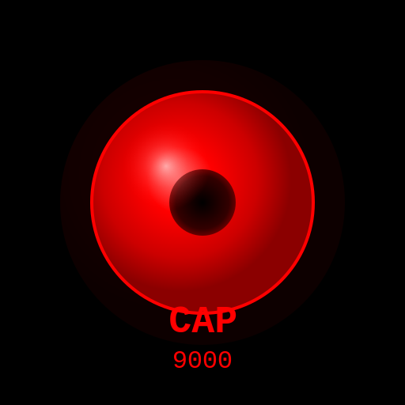

# 🔴 CAP 9000 - Cognitive Assistance Program

<div align="center">



**Assistente AI per programmazione ispirato a HAL 9000**

[](LICENSE)
[](https://www.python.org/)
[](https://www.electronjs.org/)
[](https://reactjs.org/)
[](https://ollama.ai/)

[Features](#-features) • [Installation](#-installation) • [Usage](#-usage) • [Documentation](#-documentation) • [License](#-license)

</div>

---

## 📖 Indice

- [Panoramica](#-panoramica)
- [Features](#-features)
- [Architettura](#-architettura)
- [Installazione](#-installation)
- [Utilizzo](#-usage)
- [Configurazione](#-configurazione)
- [Documentazione](#-documentation)
- [Sviluppo](#-sviluppo)
- [Build Installer](#-build-installer)
- [Troubleshooting](#-troubleshooting)
- [Roadmap](#-roadmap)
- [Contributing](#-contributing)
- [License](#-license)
- [Credits](#-credits)

---

## 🎯 Panoramica

**CAP 9000** (Cognitive Assistance Program) è un assistente AI avanzato per programmazione, ispirato al leggendario HAL 9000 di "2001: Odissea nello Spazio". 

Combina l'intelligenza artificiale locale con documentazioni ufficiali per fornire assistenza di programmazione completa, accurata e **100% offline**.

### 🌟 Perché CAP 9000?

- ✅ **Privacy Totale**: Tutto rimane sul tuo computer
- ✅ **Offline First**: Funziona senza internet (dopo setup)
- ✅ **Nessun Costo API**: Zero abbonamenti mensili
- ✅ **Nessun Rate Limiting**: Usa quanto vuoi
- ✅ **Documentazioni Ufficiali**: Risposte accurate e aggiornate
- ✅ **Multi-Lingua**: Interfaccia in 8 lingue europee
- ✅ **Open Source**: Codice completamente ispezionabile

---

## ✨ Features

### 🤖 **Intelligenza Artificiale Locale**

- **Ollama Integration**: Runtime LLM locale
- **CodeLlama Model**: Specializzato per coding (~3.8 GB)
- **Modelli Alternativi**: Qwen2.5-Coder, DeepSeek-Coder, Phi-3
- **Streaming Risposte**: Output progressivo in tempo reale
- **RAG System**: Retrieval-Augmented Generation con docs ufficiali

### 📚 **Documentazioni Ufficiali Integrate**

- **Python**: Tutorial, Library, Reference, PEP 8
- **Java**: Tutorial, API Reference
- **JavaScript**: MDN Guide, Reference
- **C++**: Language, Containers, Algorithms
- **Go**: Effective Go, Tour
- **Fallback Automatico**: Best practices hardcoded se docs non disponibili

### 🌍 **Multi-Lingua Completo**

**Interfaccia in 8 lingue:**
- 🇬🇧 English
- 🇮🇹 Italiano
- 🇫🇷 Français
- 🇩🇪 Deutsch
- 🇪🇸 Español
- 🇵🇹 Português
- 🇳🇱 Nederlands
- 🇵🇱 Polski

**Rilevamento Automatico:**
- Da impostazioni OS
- Da lingua browser
- Da query utente (auto-detect)

### 💻 **Linguaggi Supportati**

| Linguaggio | Docs Ufficiali | Best Practices | Code Patterns |
|------------|----------------|----------------|---------------|
| Python | ✅ | ✅ | ✅ |
| Java | ✅ | ✅ | ✅ |
| JavaScript | ✅ | ✅ | ✅ |
| C | ⚠️ | ✅ | ✅ |
| C++ | ✅ | ✅ | ✅ |
| Go | ✅ | ✅ | ✅ |

### 🎨 **Design HAL 9000 Autentico**

- **Occhio Rosso Iconico**: Animazione pulsante
- **Tema Scuro**: Nero/rosso con glow effects
- **Monospace Font**: Courier New stile terminale
- **Citazioni Film**: Easter eggs da "2001"
- **Splash Screen**: Avvio cinematico

### 💬 **Gestione Conversazioni**

- **Persistenza Locale**: Salvataggio automatico
- **Import/Export**: JSON format
- **Sidebar Navigazione**: Tutte le conversazioni
- **Eliminazione 1-Click**: Con conferma
- **Ricerca**: Trova conversazioni rapidamente

### 🎯 **Code Highlighting**

- **VS Code Dark+ Theme**: Syntax highlighting autentico
- **Copy Button**: Copia codice con 1 click
- **Multi-Language**: Supporto automatico
- **Line Numbers**: Numerazione linee
- **Responsive**: Adatta a dimensioni finestra

### ⚡ **Performance**

- **Streaming Real-Time**: Risposte progressive
- **Input Bloccato**: Durante generazione risposta
- **Progress Feedback**: Placeholder dinamico
- **Lazy Loading**: Caricamento ottimizzato
- **Cache Intelligente**: Docs in memoria

---

## 🏗️ Architettura

### **Stack Tecnologico**

```
┌─────────────────────────────────────────┐
│           ELECTRON DESKTOP              │
│  (macOS, Windows, Linux)                │
└──────────────┬──────────────────────────┘
               │
    ┌──────────┴──────────┐
    │                     │
┌───▼────────┐    ┌──────▼─────────┐
│  FRONTEND  │    │    BACKEND     │
│  (React)   │◄───┤  (Flask/Python)│
│  Port 5173 │    │   Port 5001    │
└────────────┘    └────────┬───────┘
                           │
              ┌────────────┴────────────┐
              │                         │
      ┌───────▼────────┐      ┌────────▼─────────┐
      │  OLLAMA SERVER │      │   RAG SYSTEM     │
      │  localhost:11434│      │  (Docs Locali)   │
      └───────┬────────┘      └──────────────────┘
              │
      ┌───────▼────────┐
      │  CODELLAMA     │
      │  Model (~3.8GB)│
      └────────────────┘
```

### **Componenti Principali**

#### **Frontend (React + Vite)**
- `App.jsx`: Componente principale
- `SplashScreen.jsx`: Schermata avvio
- `translations.js`: Sistema i18n
- `conversationStorage.js`: Persistenza locale

#### **Backend (Flask + Python)**
- `app.py`: Server Flask API
- `llm_handler.py`: Gestione Ollama
- `rag_system.py`: RAG con docs
- `language_detector.py`: Auto-detect lingua

#### **LLM Layer**
- **Ollama**: Server LLM locale
- **CodeLlama**: Modello AI coding
- **RAG**: Documentazioni integrate

#### **Storage**
- **LocalStorage**: Conversazioni browser
- **FileSystem**: Documentazioni locali
- **Ollama Models**: ~/.ollama/models/

---

## 🚀 Installation

### **Requisiti Sistema**

| Componente | Minimo | Raccomandato |
|------------|--------|--------------|
| **OS** | macOS 10.15+ / Windows 10 / Linux | macOS 12+ / Windows 11 |
| **RAM** | 8 GB | 16 GB |
| **Disco** | 5 GB liberi | 10 GB liberi |
| **CPU** | Dual-core | Quad-core+ |
| **Python** | 3.9+ | 3.11+ |
| **Node.js** | 18+ | 20+ |

### **Installazione Rapida**

#### **1. Clone Repository**

```bash
git clone https://github.com/antoniocangiano/cap9000.git
cd cap9000
```

#### **2. Installa Ollama**

**macOS/Linux:**
```bash
curl -fsSL https://ollama.ai/install.sh | sh
```

**Windows:**
```powershell
# Download da https://ollama.ai/download
# Esegui OllamaSetup.exe
```

#### **3. Scarica Modello CodeLlama**

```bash
ollama pull codellama
```

#### **4. Installa Dipendenze Python**

```bash
pip install -r requirements.txt
```

#### **5. Installa Dipendenze Frontend**

```bash
cd frontend
npm install
cd ..
```

#### **6. (Opzionale) Scarica Documentazioni**

```bash
python3 download_docs.py
```

#### **7. Avvia CAP 9000**

```bash
./run.sh
```

### **Installazione da Installer**

#### **macOS**

1. Download `CAP-9000-1.0.0.dmg`
2. Apri DMG
3. Trascina CAP 9000 in Applications
4. Primo avvio: script post-install automatico
5. Conferma download Ollama + CodeLlama + Docs

#### **Windows**

1. Download `CAP-9000-Setup-1.0.0.exe`
2. Esegui installer
3. Scegli directory installazione
4. Seleziona componenti:
   - ☑ Ollama + CodeLlama
   - ☑ Documentazioni
5. Attendi download (~5-10 minuti)
6. Avvia da Desktop shortcut

---

## 📖 Usage

### **Avvio Applicazione**

```bash
# Da terminale
./run.sh

# O da script
./start_app.sh
```

### **Primo Utilizzo**

1. **Splash Screen**: Attendi caricamento (3-5 sec)
2. **Verifica Ollama**: Controllo automatico
3. **Lingua**: Rilevata automaticamente da OS
4. **Conversazione**: Inizia a chattare!

### **Comandi Base**

```
# Chiedi aiuto su Python
"Come leggere un file in Python?"

# Richiedi esempio codice
"Fammi un esempio di API REST in Java"

# Debug codice
"Questo codice ha un errore: [incolla codice]"

# Best practices
"Quali sono le best practices per Go?"
```

### **Gestione Conversazioni**

- **Nuova Conversazione**: Click "+" in sidebar
- **Elimina Conversazione**: Click "🗑️" (con conferma)
- **Export Conversazione**: Click "📥"
- **Import Conversazione**: Click "📤" e seleziona JSON

### **Cambio Lingua**

- **Automatico**: Rilevata da OS
- **Manuale**: Modifica `frontend/src/i18n/translations.js`

### **Shortcuts**

| Azione | Shortcut |
|--------|----------|
| Invia messaggio | `Enter` |
| Nuova conversazione | `Cmd/Ctrl + N` |
| Copia codice | Click su `Copy` |
| Scroll to bottom | Automatico |

---

## ⚙️ Configurazione

### **Cambio Modello LLM**

**File:** `app.py` linea 17

```python
# Default: CodeLlama 7B
llm = LLMHandler(model="codellama")

# Alternative:
llm = LLMHandler(model="qwen2.5-coder:7b")  # Migliore qualità
llm = LLMHandler(model="phi3")              # Più leggero
llm = LLMHandler(model="deepseek-coder")    # Alternativa
```

### **Configurazione Ollama**

**File:** `llm_handler.py` linea 11

```python
def __init__(self, model="codellama", ollama_url="http://localhost:11434"):
    # Cambia porta se necessario
    # ollama_url="http://localhost:8080"
```

### **Dimensione Snippet Docs**

**File:** `rag_system.py` linea 65

```python
# Caratteri per file docs
content = f.read(5000)  # Default: 5000

# Caratteri per snippet risposta
return content[:2000]  # Default: 2000
```

### **Lingue Supportate**

**File:** `frontend/src/i18n/translations.js`

Aggiungi nuove lingue:

```javascript
export const translations = {
  en: { /* ... */ },
  it: { /* ... */ },
  ru: {  // Nuova lingua
    title: "CAP 9000",
    // ... traduzioni
  }
};
```

---

## 📚 Documentation

### **Guide Disponibili**

| File | Descrizione |
|------|-------------|
| `README.md` | Questo file |
| `INSTALLER_README.md` | Guida build installer |
| `DOCUMENTATION_SETUP.md` | Setup documentazioni |
| `DISK_SPACE.md` | Requisiti spazio disco |
| `LLM_INFO.md` | Info modelli LLM |
| `CHANGELOG.md` | Storia commit e evolutive |

### **API Documentation**

#### **Flask Backend API**

**POST `/api/query`**
```json
{
  "query": "Come leggere un file?",
  "language": "Python"
}
```

**Response:**
```json
{
  "response": "Per leggere un file in Python...",
  "language": "Python",
  "error": false,
  "source": "llm"
}
```

**POST `/api/query/stream`**
```json
{
  "query": "Esempio API REST",
  "language": "Java"
}
```

**Response:** Server-Sent Events (SSE)
```
data: {"content": "Per", "done": false}
data: {"content": " creare", "done": false}
...
data: {"content": "", "done": true}
```

**GET `/api/languages`**
```json
{
  "languages": ["Python", "Java", "JavaScript", "C", "C++", "Go"]
}
```

---

## 🛠️ Sviluppo

### **Setup Ambiente Dev**

```bash
# Clone repo
git clone https://github.com/antoniocangiano/cap9000.git
cd cap9000

# Installa dipendenze
pip install -r requirements.txt
cd frontend && npm install && cd ..

# Avvia in dev mode
./run.sh
```

### **Struttura Progetto**

```
cap9000/
├── frontend/                 # React frontend
│   ├── src/
│   │   ├── App.jsx          # Main component
│   │   ├── components/      # React components
│   │   └── i18n/            # Traduzioni
│   ├── public/              # Assets statici
│   └── dist/                # Build output
├── backend/
│   ├── app.py               # Flask server
│   ├── llm_handler.py       # Ollama integration
│   ├── rag_system.py        # RAG system
│   └── *.py                 # Altri moduli
├── build-resources/         # Risorse build
│   ├── icons/               # Icone app
│   ├── installer.nsh        # Script NSIS
│   └── postinstall.sh       # Script macOS
├── installer-scripts/       # Script installer
├── local_docs/              # Docs scaricate
├── package.json             # Electron config
├── requirements.txt         # Python deps
└── README.md                # Questo file
```

### **Development Workflow**

```bash
# 1. Modifica codice
vim frontend/src/App.jsx

# 2. Build frontend
cd frontend && npm run build && cd ..

# 3. Test
./run.sh

# 4. Commit
git add -A
git commit -m "feat: nuova feature"

# 5. Push
git push origin main
```

### **Testing**

```bash
# Test backend
python3 -m pytest tests/

# Test frontend
cd frontend && npm test

# Test integrazione
./run.sh
# Usa app manualmente
```

---

## 📦 Build Installer

### **Prerequisiti**

```bash
npm install --save-dev electron-builder
```

### **Build macOS**

```bash
npm run build:mac
# Output: dist/CAP-9000-1.0.0.dmg
```

### **Build Windows**

```bash
npm run build:win
# Output: dist/CAP-9000-Setup-1.0.0.exe
```

### **Build Tutti**

```bash
npm run build:all
# Output: dist/ con tutti gli installer
```

### **Export su Desktop**

```bash
# macOS
cp dist/CAP-9000-1.0.0.dmg ~/Desktop/

# Windows
cp dist/CAP-9000-Setup-1.0.0.exe ~/Desktop/
```

---

## 🐛 Troubleshooting

### **Problema: "Ollama not available"**

```bash
# Verifica Ollama running
ps aux | grep ollama

# Avvia Ollama
ollama serve

# Verifica porta
curl http://localhost:11434/api/tags
```

### **Problema: "Model not found"**

```bash
# Lista modelli
ollama list

# Scarica CodeLlama
ollama pull codellama
```

### **Problema: "Out of memory"**

```bash
# Usa modello più leggero
ollama pull phi3
# Modifica app.py: model="phi3"
```

### **Problema: "Frontend not loading"**

```bash
# Rebuild frontend
cd frontend
npm run build
cd ..

# Riavvia app
./run.sh
```

### **Problema: "Docs not found"**

```bash
# Scarica docs
python3 download_docs.py

# Verifica
ls local_docs/
```

---

## 🗺️ Roadmap

### **v1.1 (Q1 2025)**
- [ ] Plugin system
- [ ] Custom themes
- [ ] Voice input
- [ ] Code execution sandbox

### **v1.2 (Q2 2025)**
- [ ] Multi-file context
- [ ] Git integration
- [ ] Project templates
- [ ] Collaborative features

### **v2.0 (Q3 2025)**
- [ ] Web version
- [ ] Mobile apps
- [ ] Cloud sync (optional)
- [ ] Marketplace plugins

---

## 🤝 Contributing

Contributi benvenuti! Per favore:

1. Fork il repository
2. Crea un branch (`git checkout -b feature/AmazingFeature`)
3. Commit le modifiche (`git commit -m 'feat: Add AmazingFeature'`)
4. Push al branch (`git push origin feature/AmazingFeature`)
5. Apri una Pull Request

### **Guidelines**

- Segui lo stile codice esistente
- Aggiungi test per nuove features
- Aggiorna documentazione
- Usa commit messages convenzionali

---

## 📄 License

Questo progetto è rilasciato sotto licenza **MIT License**.

Vedi [LICENSE](LICENSE) per dettagli.

---

## 🙏 Credits

### **Autore**

**Antonio Cangiano**
- Email: antonio.web2music@gmail.com
- GitHub: [@antoniocangiano](https://github.com/antoniocangiano)

### **Ispirazione**

- **HAL 9000** da "2001: Odissea nello Spazio" (Stanley Kubrick, Arthur C. Clarke)
- Design e mood ispirati al leggendario computer HAL 9000

### **Tecnologie**

- [Ollama](https://ollama.ai/) - LLM runtime
- [CodeLlama](https://github.com/facebookresearch/codellama) - Meta AI
- [Electron](https://www.electronjs.org/) - Desktop framework
- [React](https://reactjs.org/) - UI library
- [Flask](https://flask.palletsprojects.com/) - Python web framework
- [Vite](https://vitejs.dev/) - Build tool
- [TailwindCSS](https://tailwindcss.com/) - CSS framework

### **Documentazioni Ufficiali**

- Python Docs
- Java Docs (Oracle)
- MDN Web Docs (Mozilla)
- cppreference.com
- Go Documentation

---

## 📞 Support

Per supporto, domande o feedback:

- **Email**: antonio.web2music@gmail.com
- **Issues**: [GitHub Issues](https://github.com/antoniocangiano/cap9000/issues)
- **Discussions**: [GitHub Discussions](https://github.com/antoniocangiano/cap9000/discussions)

---

<div align="center">

**CAP 9000** - Cognitive Assistance Program

*"I am putting myself to the fullest possible use, which is all I think that any conscious entity can ever hope to do."*

© 2025 Antonio Cangiano

</div>
